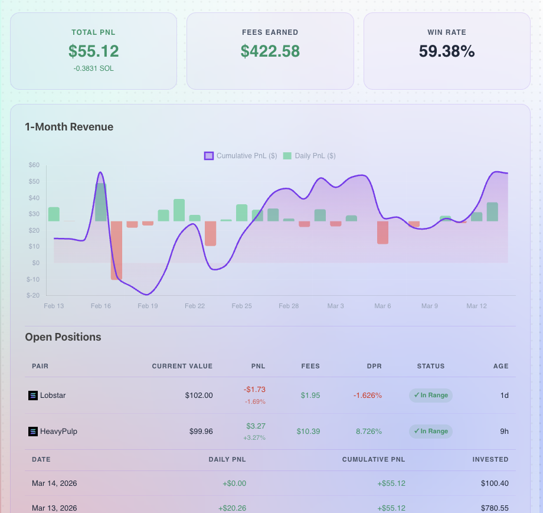

# LP Metrics

A WordPress plugin that displays liquidity pool position metrics for a Solana wallet using the [LPAgent API](https://docs.lpagent.io).



## Features

- **Overview stat cards** — Total PnL (USD + SOL), Fees Earned, Win Rate
- **1-Month Revenue chart** — Cumulative PnL line + daily PnL bars via Chart.js
- **Open Positions table** — Pair, Current Value, PnL, Uncollected Fees, DPR, In/Out Range status, Age
- **Revenue date table** — Daily PnL, Cumulative PnL, and Invested amount per day
- Glassmorphism design — matches the fphx-theme purple/pink aesthetic
- Transient caching with configurable TTL

## Requirements

- WordPress 5.8+
- PHP 7.4+
- LPAgent API key

## Installation

1. Upload the `lp-metrics` folder to `/wp-content/plugins/`
2. Activate the plugin in **Plugins → Installed Plugins**
3. Go to **Settings → LP Metrics** and enter your LPAgent API key
4. Add the shortcode to any page or post

## Usage

```
[lp_metrics wallet="YOUR_WALLET_ADDRESS" protocol="meteora"]
```

### Shortcode Parameters

| Parameter  | Default    | Description                        |
|------------|------------|------------------------------------|
| `wallet`   | *(required)* | Solana wallet address            |
| `protocol` | `meteora`  | LP protocol (e.g. `meteora`, `orca`) |

## Settings

Navigate to **Settings → LP Metrics** to configure:

- **LPAgent API Key** — your API key from [lpagent.io](https://lpagent.io)
- **Default Protocol** — fallback protocol used when not specified in shortcode
- **Cache Duration** — how long API responses are cached (seconds)
- **Clear Cache** — manually flush all cached LP Metrics data

## Author

[@fPHXGallery](https://github.com/fphxgallery)
